<div align="center">

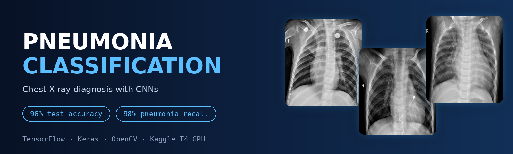

<br/>


### Can a compact CNN learn to spot pneumonia in a chest X-ray?
**Two CNNs. 5,856 X-rays. 96% test accuracy and 98% pneumonia recall.**

[The Problem](#-the-problem) ·
[Dataset](#-the-dataset) ·
[Pipeline](#-the-pipeline) ·
[Models](#-the-two-models) ·
[Results](#-results) ·
[Run it](#-run-it) ·
[Limitations](#-limitations--future-work)

</div>

---

## 🫁 The Problem

**Pneumonia** fills the lungs' air sacs with fluid or pus. It is treatable, but it can be life-threatening for infants, adults over 65, and people with weakened immune systems. A chest X-ray is one of the first tools a clinician reaches for, and reading it takes trained eyes and time.

This project asks: **can a Convolutional Neural Network learn to tell a healthy chest X-ray from a pneumonia one, and which architecture choices actually make the difference?**

<div align="center">
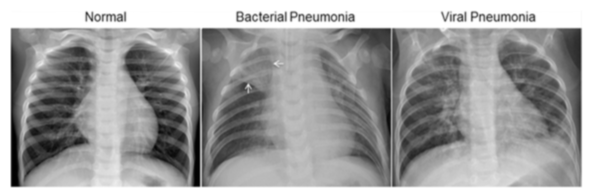
<br/>
<sub>Normal lungs (left) versus bacterial (middle) and viral (right) pneumonia. Pneumonia shows up as hazy, opaque regions.</sub>
</div>

### Why a CNN?

| Era | Approach | Trade-off |
|---|---|---|
| Classical ML | Hand-crafted texture/shape features → SVM, KNN | Manual feature engineering; limited on complex patterns |
| **Deep learning (this project)** | **CNNs learn features directly from pixels** | **Needs enough data, but no manual features** |
| Transformers | Attention-based vision models | Often higher accuracy, at a much higher compute cost |

---

## 🩻 The Dataset

The [Chest X-Ray Images (Pneumonia)](https://www.kaggle.com/datasets/paultimothymooney/chest-xray-pneumonia) dataset, originally from [Mendeley Data](https://data.mendeley.com/datasets/rscbjbr9sj/2) (license: **CC BY 4.0**), published in [*Cell*](http://www.cell.com/cell/fulltext/S0092-8674(18)30154-5).

| | |
|---|---|
| **Images used** | 5,856 JPEG chest X-rays |
| **Classes** | `NORMAL` (0) · `PNEUMONIA` (1) |
| **Balance** | ~73% pneumonia / ~27% normal |

The Kaggle release ships with a tiny validation folder, so I **pooled all three folders and re-split 80 / 10 / 10**, stratified by label, with a fixed seed (`random_state=42`) for reproducibility.

<div align="center">
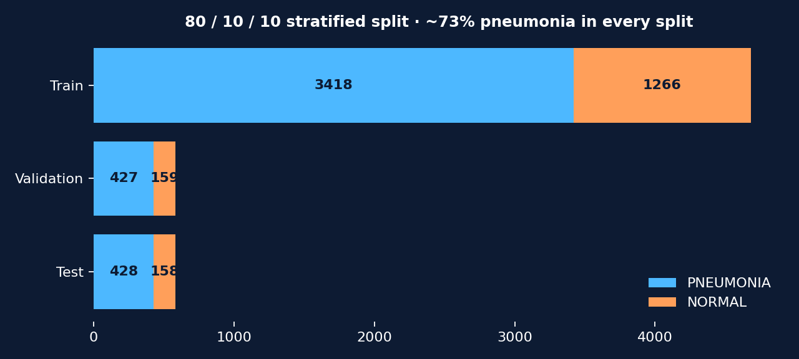
</div>

<details>
<summary><b>👀 Peek at the raw data (click to expand)</b></summary>
<br/>

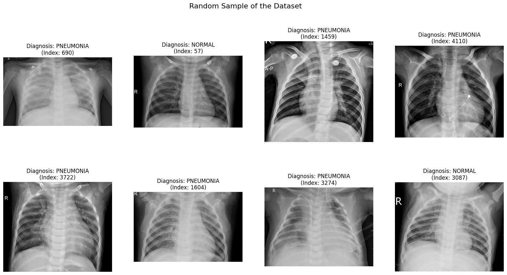

Two things jump out: images come in **many different sizes**, and they are all **grayscale**. Sizes range widely (the two samples I inspected were 1438×1140 and 1320×976), and most images are wider than tall, with aspect ratios around 1.3 to 1.6.

<table>
<tr>
<td>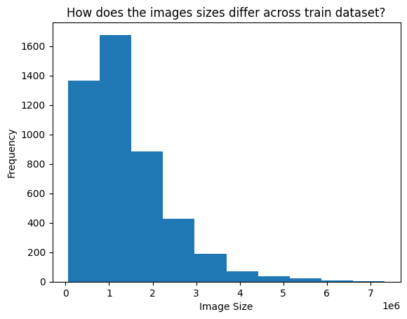</td>
<td>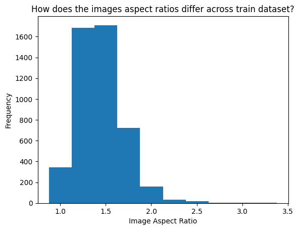</td>
</tr>
</table>

</details>

---

## 🔬 The Pipeline

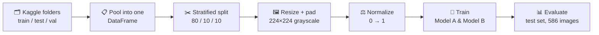

### The preprocessing decision that mattered

My first attempt used a plain resize to 224×224. It **stretched the aspect ratio** of the X-rays, and the model overfit. Switching to **aspect-ratio-preserving resize with centered black padding** fixed it.

```python
def resize_image_with_padding(path):
    img = cv2.imread(path, cv2.IMREAD_GRAYSCALE)
    h, w = img.shape[:2]
    scale = IMG_SIZE / max(h, w)                      # fit the longest side
    img = cv2.resize(img, (int(w * scale), int(h * scale)), interpolation=cv2.INTER_AREA)
    # center the image on a black 224×224 canvas
    dh, dw = IMG_SIZE - img.shape[0], IMG_SIZE - img.shape[1]
    return cv2.copyMakeBorder(img, dh // 2, dh - dh // 2, dw // 2, dw - dw // 2,
                              cv2.BORDER_CONSTANT, value=0)
```

<div align="center">
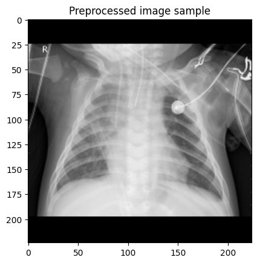
<br/>
<sub>A preprocessed sample: proportions preserved, padded to a 224×224 square.</sub>
</div>

---

## 🧠 The Two Models

### Model A: the baseline
A deliberately minimal network: one non-overlapping convolution, average pooling, and a dense head.

```
Conv2D(32, 4×4, stride 4) → AvgPool(2×2) → Flatten → Dense(128) → Dropout(0.5) → Dense(1, sigmoid)
```

### Model B: the proposed model
A deeper network with batch normalization, on-the-fly augmentation, and a learning-rate schedule.

```
RandomFlip
→ [Conv 3×3 → BatchNorm → ReLU → MaxPool] × 4   (32 → 64 → 128 → 256 filters)
→ GlobalAveragePooling → Dense(128) → Dropout(0.4) → Dense(1, sigmoid)
```

| | **Model A** | **Model B** |
|---|:---:|:---:|
| Parameters | 3,212,065 (12.25 MB) | **422,785 (1.61 MB)** |
| Conv blocks | 1 | 4 |
| Batch normalization | ❌ | ✅ |
| Data augmentation | ❌ | ✅ horizontal flip |
| LR schedule | ❌ | ✅ `ReduceLROnPlateau` (×0.2, patience 3) |
| Epochs / batch size | 25 / 32 | 50 / 64 |
| Optimizer / loss | Adam / binary cross-entropy | Adam / binary cross-entropy |

> 💡 **Model B has about 7.6× fewer parameters than Model A and still performs better.** A big Flatten → Dense layer is parameter-hungry, while global average pooling keeps the head lean, which likely helps it generalize.

---

## 📈 Results

Evaluated on **586 X-rays the models never saw** during training or validation.

<div align="center">
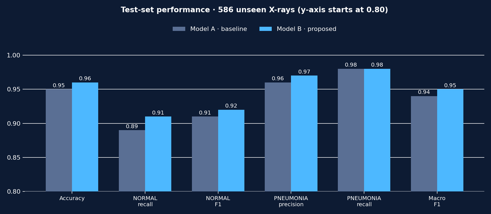
</div>

| Metric | Model A | Model B |
|---|:---:|:---:|
| **Accuracy** | 0.95 | **0.96** |
| NORMAL precision / recall / F1 | 0.93 / 0.89 / 0.91 | **0.94 / 0.91 / 0.92** |
| PNEUMONIA precision / recall / F1 | 0.96 / 0.98 / 0.97 | **0.97** / 0.98 / 0.97 |
| Macro avg F1 | 0.94 | **0.95** |

### Confusion matrices

<table>
<tr>
<td align="center"><b>Model A</b><br/>17 false alarms · 10 missed cases<br/>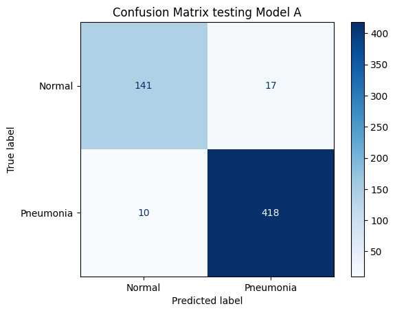</td>
<td align="center"><b>Model B</b><br/>15 false alarms · 9 missed cases<br/>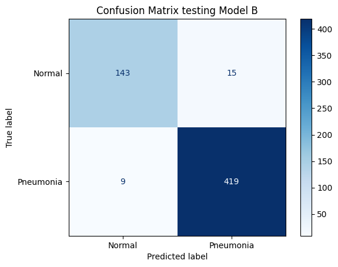</td>
</tr>
</table>

In a medical setting, **a missed pneumonia case (false negative) is far worse than a false alarm**, so recall on the `PNEUMONIA` class is the metric to watch. Both models catch about 98% of pneumonia cases, and Model B misses one fewer while also raising fewer false alarms.

### Training behavior

Model B's real advantage shows in the curves: train and validation track each other closely, while Model A's validation accuracy plateaus as training accuracy keeps climbing, a sign of overfitting.

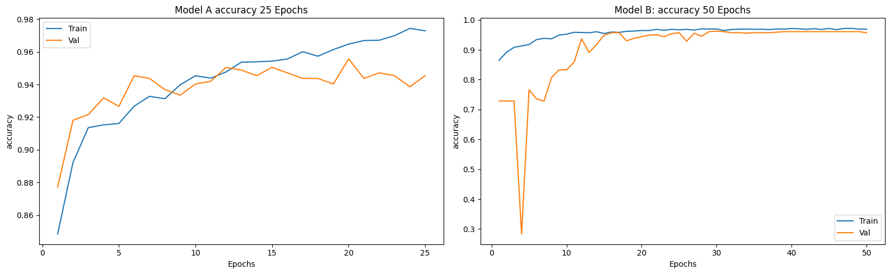

<details>
<summary><b>📉 More training curves: loss, recall, precision</b></summary>
<br/>

**Loss**: Model A's validation loss turns upward late in training; Model B ends low and stable.
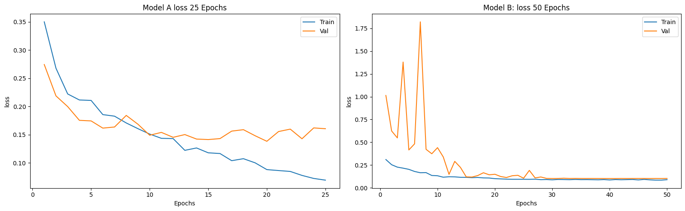

**Recall**: Model A's validation recall is shaky throughout; Model B settles after the first ~10 epochs.
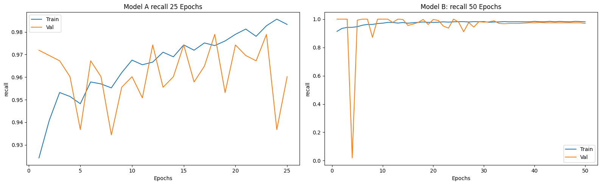

**Precision**: Model A is high but inconsistent; Model B's train and validation lines align.
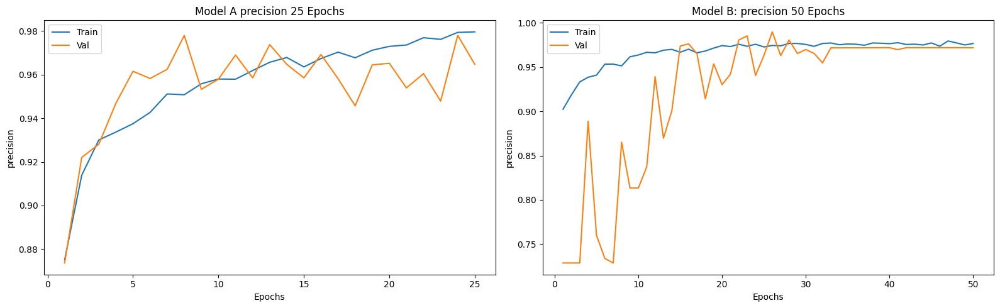

</details>

### Honest observation: the rough start of Model B
In its first few epochs, Model B's validation accuracy sat at **72.9%, exactly the share of pneumonia images in the validation set**. It was predicting "pneumonia" for everything, and it briefly swung the other way at epoch 4. This is likely the network settling on an imbalanced dataset. The learning-rate schedule and the extra epochs smoothed it out, but it is a reminder to always look at the curves, not just the final number.

---

## 🚀 Run it

**The easiest way** is Kaggle, which is what this notebook was built on (free GPU, dataset one click away):

1. Create a Kaggle notebook and add the [Chest X-Ray Pneumonia dataset](https://www.kaggle.com/datasets/paultimothymooney/chest-xray-pneumonia).
2. Upload `Pneumonia-Classification-CNN.ipynb` and enable a GPU accelerator.
3. Run all cells.

**Locally:**

```bash
git clone https://github.com/<your-username>/<your-repo>.git
cd <your-repo>
pip install tensorflow opencv-python pillow imagesize numpy pandas matplotlib scikit-learn
```

Then download the dataset and change this one line in the notebook to point at your copy:

```python
base_path = '/kaggle/input/chest-xray-pneumonia/chest_xray'   # ← your path here
```

---

## 🗂️ Repository structure

```
├── Pneumonia-Classification-CNN.ipynb   # full notebook: EDA → preprocessing → training → evaluation
├── assets/                              # figures used in this README
└── README.md
```

---

## ⚠️ Limitations & future work

Being upfront about what this project is *not*:

- **Not a medical device.** This is a course project for learning. It must never be used for real diagnosis.
- **Possible patient overlap across splits.** Pooling the folders and re-splitting randomly means X-rays from the same patient could land in both training and test sets, which can inflate scores. A patient-level split would be a stricter test.
- **One dataset, one patient population** (pediatric patients from a single source). There is no external validation.
- **Class imbalance** (~73/27) is handled by stratification only. There are no class weights or resampling.
- **Fixed 0.5 threshold.** In practice you would tune it to trade some false alarms for even higher recall.

**Ideas for next steps**
- [ ] Transfer learning (ResNet50, EfficientNet, DenseNet121)
- [ ] **Grad-CAM** heatmaps to show *where* the model looks
- [ ] Class weights or focal loss for the imbalance
- [ ] Richer augmentation (rotation, zoom, contrast)
- [ ] Patient-level splitting and external validation
- [ ] Bacterial vs. viral pneumonia as a 3-class task
- [ ] A small Gradio/Streamlit demo

---

## 📚 References

1. Kermany et al., *Identifying Medical Diagnoses and Treatable Diseases by Image-Based Deep Learning*, [Cell, 2018](http://www.cell.com/cell/fulltext/S0092-8674(18)30154-5)
2. Dataset on [Kaggle](https://www.kaggle.com/datasets/paultimothymooney/chest-xray-pneumonia) and [Mendeley Data](https://data.mendeley.com/datasets/rscbjbr9sj/2) (CC BY 4.0)
3. [Mayo Clinic: Pneumonia, symptoms and causes](https://www.mayoclinic.org/diseases-conditions/pneumonia/symptoms-causes/syc-20354204)
4. [OpenCV: basic operations on images](https://docs.opencv.org/4.x/d3/df2/tutorial_py_basic_ops.html)

---

<div align="center">

**Birzeit University · Computer Science Department · COMP4388: Machine Learning**

Built by **Abdallah Aabed** (1210802)

⭐ If you found this useful, consider starring the repo!

</div>
